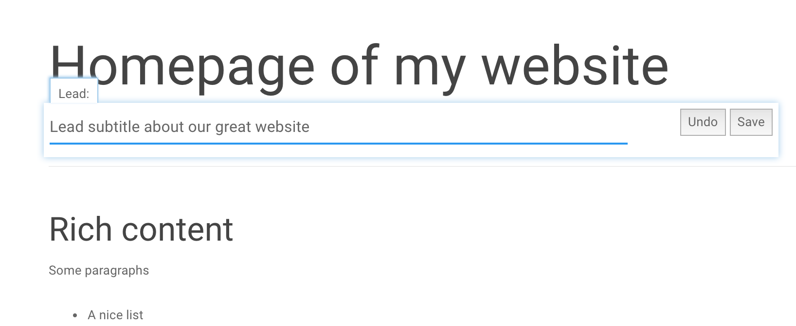

===================================
Inline page editing
===================================

Gerbi CMS provide a way to easily edit the placeholder's content
on your own frontend when you are authenticated as a staff user.

To activate the feature on your frontend you need to add 2 tags inside your templates. One in your <head> tag and one in the <body> tag::

    <html>
        <head>
            ...
            
        </head>
        <body>
            ...
            
        </body>
    </html>

For placeholder editing to work properly you will need to surround the placeholder with an HTML element like so::

    

        
    

Placeholder editing works automatically by injecting an HTML comment into the placeholder output. So thing
like this will not work::

    

        
    

Because the rendered comment will not result into an HTML node::

    

        ">
    

This will not only not work but will also break the image source in edit mode. Here
is an imperfect way to fix this problem::

    
        <button>Change image: </button>
    
    
        
        
    

When the as option is used the special HTML comment is not generated therefore not breaking the source of the image. The solution is not perfect because the image source doesn't get updated automatically.