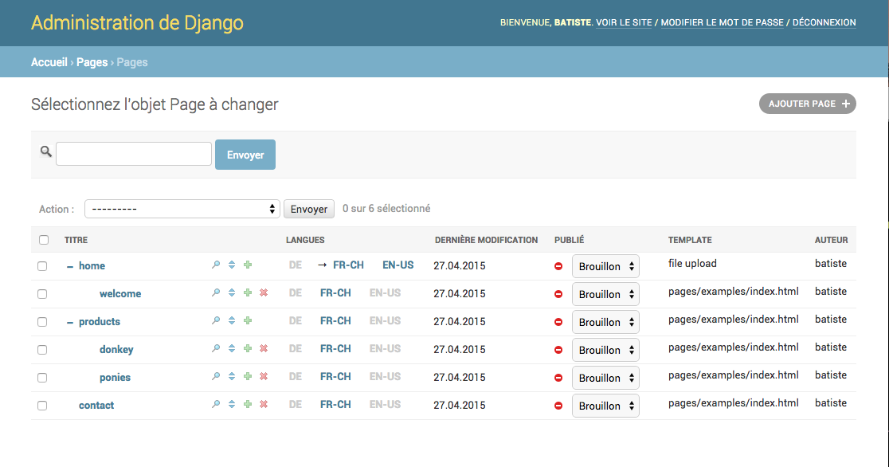

============
Introduction
============

Gerbi CMS enable you to create and administrate hierarchical pages in a simple and powerful way.

Gerbi CMS is based around a placeholders concept. A placeholder is a template tag that
you can use in your page's templates. Every time you add a placeholder in your template  a field
dynamically appears in the page admin.

The project code repository is found at this address: http://github.com/batiste/django-page-cms

.. contents::
    :local:
    :depth: 1

Screenshot
============

Key features
============

  * :doc:`Automatic creation of localized placeholders </placeholders>`
    (content area) in admin by adding placeholders tags into page templates.
  * Django admin application integration.
  * Multilingual support.
  * `Search indexation with Django haystack <http://haystacksearch.org/>`_.
  * Fine grained rights management (publisher, hierarchy manager, language manager).
  * :ref:`Rich Text Editors <placeholder-widgets-list>` are directly available.
  * Page can be moved in the tree in a visual way.
  * The tree can be expanded/collapsed. A cookie remember your preferences.
  * Possibility to specify a different page URL for each language.
  * Directory-like page hierarchy (page can have the same name if they are not in the same directory).
  * Every page can have multiple alias URLs. It's especially useful to migrate websites.
  * :doc:`Possibility to integrate 3th party apps </3rd-party-apps>`.

Other features
==============

Here is the list of features you can enable/disable:

  * Revisions,
  * Image placeholder,
  * Support for future publication start/end date,
  * Page redirection to another page,
  * Page tagging,
  * `Sites framework <http://docs.djangoproject.com/en/dev/ref/contrib/sites/#ref-contrib-sites>`_

Dependencies & Compatibility
============================

  * Django 1.5, 1.6
  * Python 2.7, 3.3
  * `django-haystack if used <http://haystacksearch.org/>`_
  * `django-authority for per object rights management <http://bitbucket.org/jezdez/django-authority/src/>`_.
  * `django-mptt <http://github.com/batiste/django-mptt/>`_
  * `django-taggit <http://http://github.com/alex/django-taggit>`_ (if PAGE_TAGGING = True)
  * Gerbi CMS is shipped with jQuery.
  * Compatible with MySQL, PostgreSQL, SQLite3, some issues are known with Oracle.

.. note::

    For install instruction go to the :doc:`Installation section </installation>`

How to contribute
==================

I recommend to `create a clone on github  <http://github.com/batiste/django-page-cms>`_ and
make modifications in your branch. Please follow those instructions:

  * Add your name to the AUTHORS file.
  * Write tests for any new code. Keep the test coverage >= 90%.
  * Follow the pep08 as much as possible.
  * Add new features in the `doc/changelog.rst` file.
  * Document how the user might use a new feature.
  * If a new dependency is introduced, it should have a setting and be disabled by default.
  * Be careful of performance regresssion.
  * Every new CMS setting should start with PAGE_<something>
  * Every new template_tag should start with pages_<something>

Report a bug
============

`Github issues <https://github.com/batiste/django-page-cms/issues>`_

Run the tests
-------------------------

Gerbi CMS try to keep the code base stable. The test coverage is higher
than 90% and we try to keep it that way. To run the test suite::

    $ python pages/test_runner.py

Translations
------------

This application is available in English, German, French, Spanish, Danish, Russian and Hebrew.

