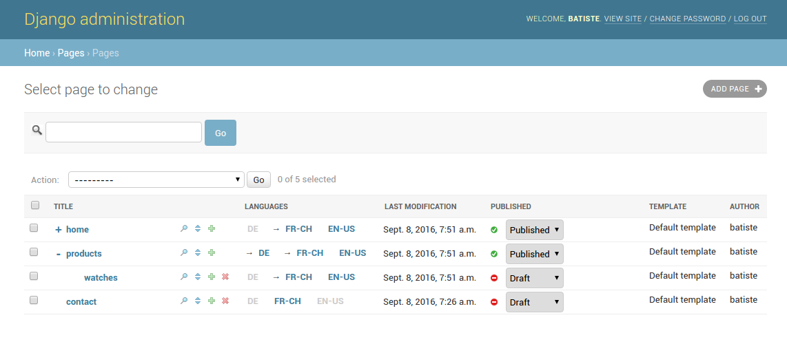
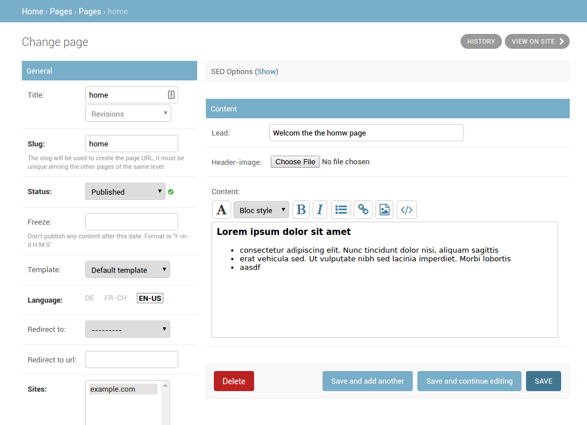

============
Introduction
============

Gerbi CMS enable you to create and administrate hierarchical pages in a simple and powerful way.

Gerbi CMS is based around a placeholders concept. A placeholder is a template tag that
you can use in your page's templates. Every time you add a placeholder in your template  a field
dynamically appears in the page admin.

The project code repository is found at this address: http://github.com/batiste/django-page-cms

.. contents::
    :local:
    :depth: 1

Screenshot
============

Admin page list

Admin page edition

Features
============

  * :doc:`Automatic creation of localized placeholders </placeholders>`
    (content area) in admin by adding placeholders tags into page templates.
  * Django admin application integration.
  * Multilingual support.
  * Inline editing.
  * Media Library.
  * Revisions.
  * Plugin for page content export and import in JSON files within the admin interface
  * Plugin for page content export and import in PO format for translations
  * `Search indexation with Django haystack <http://haystacksearch.org/>`_.
  * Advanced rights management (publisher, language manager).
  * :ref:`Rich Text Editors <placeholder-widgets-list>` are directly available.
  * Page can be moved in the tree in a visual way (drag & drop + simple click).
  * The tree can be expanded/collapsed. A cookie remember your preferences.
  * Possibility to specify a different page URL for each language.
  * Directory-like page hierarchy (page can have the same name if they are not in the same directory).
  * Every page can have multiple alias URLs. It's especially useful to migrate websites.
  * :doc:`Possibility to integrate 3th party apps </3rd-party-apps>`.
  * Image placeholder.
  * Support for future publication start/end date.
  * Page redirection to another page or arbirtrary URLs.
  * Page tagging.
  * `Sites framework <http://docs.djangoproject.com/en/dev/ref/contrib/sites/#ref-contrib-sites>`_

Dependencies & Compatibility
============================

  * Django 1.8, 1.9
  * Python 2.7, 3.3, 3.4, 3.5
  * `django-mptt <https://github.com/django-mptt/django-mptt>`_ is needed
  * `django-taggit if needed <https://github.com/alex/django-taggit>`_ (if PAGE_TAGGING = True)
  * `django-haystack if needed <http://haystacksearch.org/>`_
  * Gerbi CMS is shipped with jQuery.
  * Compatible with MySQL, PostgreSQL, SQLite3, some issues are known with Oracle.

.. note::

    For install instruction go to the :doc:`Installation section </installation>`

How to contribute
==================

:doc:`Contributions section </contributions>`

Report a bug
============

`Github issues <https://github.com/batiste/django-page-cms/issues>`_

Internationalisation
====================

This application is available in English, German, French, Spanish, Danish, Russian and Hebrew.

`We use transifex <https://www.transifex.com/batiste/django-page-cms-1/>`_

