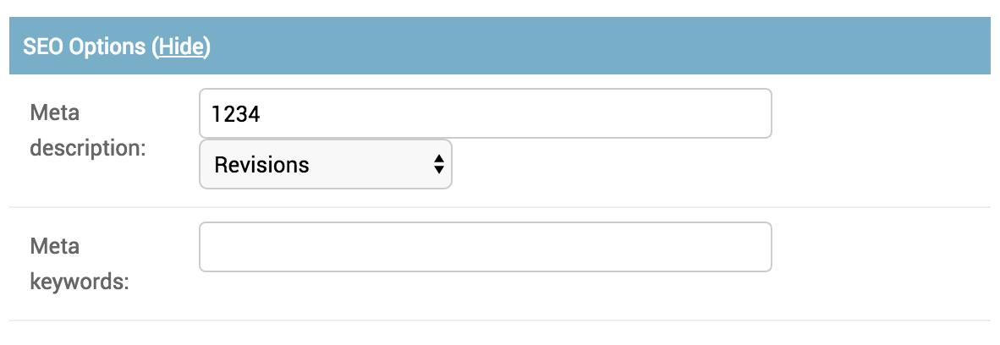
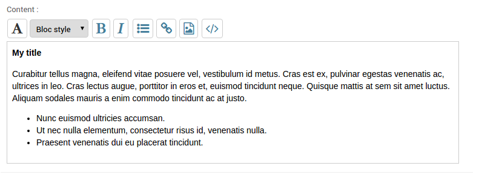
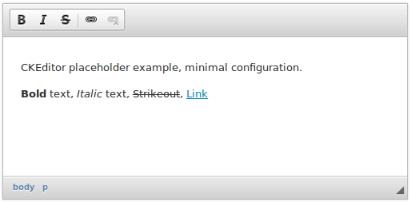

=========================
Placeholders template tag
=========================

.. contents::

The placeholder template tag is what make Gerbi CMS special. The workflow
is that you design your template first according to the page design.
Then you put placeholder tag where you want dynamic content.

For each placeholder you will get a corresponding field appearing automaticaly
in the administration interface. You can make as many templates as you want, even
use the template inheritance: this CMS administration interface will still behave as intended.

The syntax for a placeholder tag is the following:

.. code-block:: html+django

  

Enable the placeholder tags
=============================

The required syntax to load placeholder tags is the following:

.. code-block:: html+django

    

Detailed explanations on placeholder options
============================================

the **on** option
------------------

If the **on** option is omitted the CMS will automatically
take the current page (by using the `current_page` context variable)
to get the content of the placeholder.

Template syntax example

.. code-block:: html+django

    

the **with** option
----------------------

The **with** option is used to change a placeholder widget within the administration interface.

By default the CMS will use a simple `TextInput` widget. But with the **with** option
the CMS will use the the widget of your choice. Widgets need to be registered before you can use them in the CMS::

    from pages.widgets_registry import register_widget
    from django.forms import TextInput

    class NewWidget(TextInput):
        pass

    register_widget(NewWidget)

Template syntax example:

.. code-block:: html+django

    

.. note::
    :ref:`Details about how to create a new Widget for a placeholder <changing-widget>` .
    
.. note::

    This CMS is shipped with :ref:`a list of useful widgets <placeholder-widgets-list>` .

The **as** option
------------------

If you use the option **as** the content of the placeholder content will not be displayed:
a variable of your choice will be defined within the template's context.

Template syntax example:

.. code-block:: html+django

    
    

The **section** option
-------------------------

The **section** option is used to group placeholders into a section in the admin interface.
A section is collapsed by default and hides the fields.

Template syntax example:

.. code-block:: html+django

    <meta name="description" content="" />
    <meta name="description" content="" />

You will get

The **parsed** keyword
-----------------------

If you add the keyword **parsed** the content of the placeholder
will be evaluated as Django template, within the current context.
Each placeholder with the **parsed** keyword will also have
a note in the admin interface noting its ability to be evaluated as template.

Template syntax example:

.. code-block:: html+django

    

The **inherited** keyword
-------------------------

If you add the keyword **inherited** the placeholder's content displayed
on the frontend will be retrieved from the closest parent. But only if there is no
content for the current page.

Template syntax example:

.. code-block:: html+django

    

The **untranslated** keyword
-----------------------------

If you add the keyword **untranslated** the placeholder's content
will be the same whatever language your use. It's especialy useful for an image
placeholder that should remain the same in every language.

Template syntax example:

.. code-block:: html+django

    

The **shared** keyword
-----------------------------

If you add the keyword **shared** the placeholder's content
will be the same for all the pages. In effect the placeholder is
not linked to any page and editing it change
its content in all pages.

Template syntax example:

.. code-block:: html+django

    

.. _placeholderasblocks:

The **block** keyword
-----------------------------

Placeholders can also be rendered as template blocks. The content of the placeholder is then available as the `content`
variable:

.. code-block:: html+django

    
        
            <h1>Welcome: {{ content }}</h1>
        
    

Examples of other valid syntaxes
------------------------------------

You can off course combine any of those syntaxes to your convenience.
This is an example list of different possible syntaxes for this template tag:

.. code-block:: html+django

    
    
    

    ...
    
{{ right_column|safe }}

Image placeholder
=================

There is a special placeholder for images:

.. code-block:: html+django

    
        
            
        
    

A file upload field will appears into the page admin interface.

File placeholder
================

There is also a more general placeholder for files:

.. code-block:: html+django

    
        
            <a href="{{ MEDIA_URL }}{{ content }}">Download file</a>
        
    

A file upload field will appears into the page admin interface.

.. _markdownplaceholder:

Markdown placeholder
=====================

If you want to write in the MarkDown format there is a MarkDown placeholder:

.. code-block:: html+django

    

.. note::
    
    You will have to install the Markdown library

    .. code-block:: shell

        $ pip install Markdown

Contact placeholder
===================

If you want to include a simple contact form in your page, there is a contact placeholder:

.. code-block:: html+django

    

This placeholder use `settings.ADMINS` for recipients email. The template used to render
the contact form is `pages/contact.html`.

Create your own placeholder
===========================

If you want to create your own new type of placeholder,
you can simply subclass the :class:`PlaceholderNode <pages.placeholders.PlaceholderNode>`::

    from pages.placeholders import PlaceholderNode
    from pages.placeholders import parse_placeholder
    register = template.Library()

    class ContactFormPlaceholderNode(PlaceholderNode):

        def __init__(self, name, *args, **kwargs):
            ...

        def get_widget(self, page, language, fallback=Textarea):
            """Redefine this to change the widget of the field."""
            ...

        def get_field(self, page, language, initial=None):
            """Redefine this to change the field displayed in the admin."""
            ...

        def save(self, page, language, data, change):
            """Redefine this to change the way to save the placeholder data."""
            ...

        def render(self, context):
            """Output the content of the node in the template."""
            ...

    def do_contactplaceholder(parser, token):
        name, params = parse_placeholder(parser, token)
        return ContactFormPlaceholderNode(name, **params)
    register.tag('contactplaceholder', do_contactplaceholder)

And use it in your templates as a normal placeholder:

.. code-block:: html+django

    

.. _changing-widget:
    
Changing the widget of the common placeholder
=============================================

If you want to just redefine the widget of the default :class:`PlaceholderNode <pages.placeholders.PlaceholderNode>`
without subclassing it, you can just you create a valid Django Widget that take an extra language paramater::

    from django.forms import Textarea
    from django.utils.safestring import mark_safe
    from pages.widgets_registry import register_widget

    class CustomTextarea(Textarea):
        class Media:
            js = ['path to the widget extra javascript']
            css = {
                'all': ['path to the widget extra css']
            }

        def __init__(self, language=None, attrs=None, **kwargs):
            attrs = {'class': 'custom-textarea'}
            super(CustomTextarea, self).__init__(attrs)

        def render(self, name, value, attrs=None):
            rendered = super(CustomTextarea, self).render(name, value, attrs)
            return mark_safe("""Take a look at \
                    example.widgets.CustomTextarea """) \
                    + rendered

    register_widget(CustomTextarea)

Create a file named `widgets.py` (or whathever you want) somewhere in one of your project's application.
and then you can simply use the placeholder syntax:

.. code-block:: html+django

    

.. note::

    You have to make sure your `widgets.py` file is executed before using the widget. To be sure of this, you might
    import your file into the models.py of your application.

.. note::

    More examples of custom widgets are available in :mod:`pages.widgets.py <pages.widgets>`.

.. _placeholder-widgets-list:

List of placeholder widgets shipped with the CMS
================================================

Placeholder could be rendered with different widgets

TextInput
---------

A simple line input:

.. code-block:: html+django

    

Textarea
--------

A multi line input:

.. code-block:: html+django

    

AdminTextInput
--------------

A simple line input with Django admin CSS styling (better for larger input fields):

.. code-block:: html+django

    

AdminTextarea
-------------

A multi line input with Django admin CSS styling:

.. code-block:: html+django

    

FileBrowseInput
---------------

A file browsing widget:

.. code-block:: html+django

    

.. note::

    The following django application needs to be installed: http://code.google.com/p/django-filebrowser/

RichTextarea
------------

A simple Rich Text Area Editor based on jQuery:

.. code-block:: html+django

    

CKEditorPlaceholderNode
-----------------------

A simple `CKEditor <http://ckeditor.com>`_ custom placeholder::

    

The variable ``CKEDITOR_CONFIGS`` in ``settings.py`` exists to define editor
configurations. To use a custom configured editor in templates, just specify the
configuration name as follow::

    

If no configuration is specified a default configuration will be used. The
default configuration has to be defined in ``CKEDITOR_CONFIGS``. For example::

    CKEDITOR_CONFIGS = {
        'default': {
            'width': 600,
            'height': 300,
            'toolbar': 'Full',
        }
    }

.. note::

    In order to use this placeholder, the application `django-ckeditor <https://github.com/django-ckeditor/django-ckeditor>`_ needs to be
    installed and configured (trivial). `See the docs
    <https://github.com/riklaunim/django-ckeditor#django-ckeditor>`_ for
    further details. Also have a look at the example project to see a working
    implementation.
